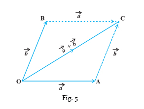
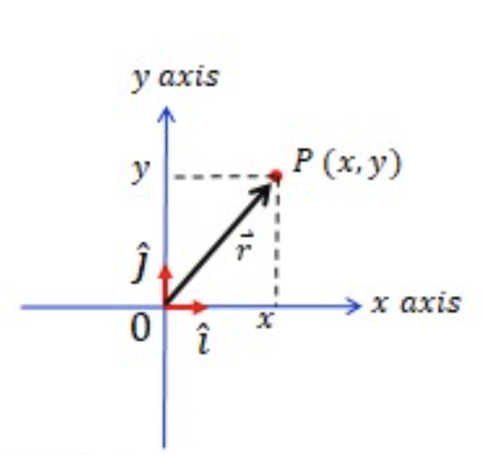
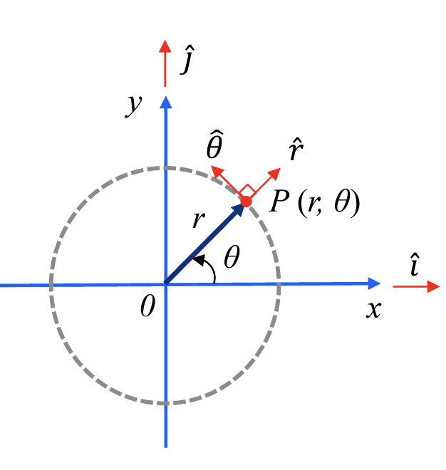
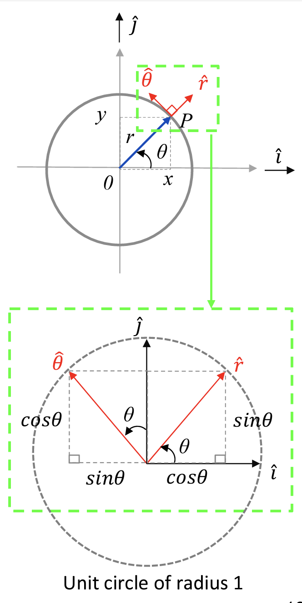

# Physical World Week 1 - Concept of Vector in Physics Engineering

- Scalar quantities are completely specified by a magnitude with appropriate units, and has no direction.

- Vector quantities are completely specified by a magnitude with appropriate units, and has a direction.

## Vector

- A vector is a quantity that has both **magnitude** and **direction**. It is represented by an arrow. The length of the arrow represents the magnitude of the vector and the arrow points in the direction of the vector.

- Two vectors are **identical** if they have the same magnitude and direction.

### Magnitude and Direction in Vectors

- A vector of $A$ is represented as $|\vec{A}|$
- Magnitude of $|\vec{A}|$ is $A$
- Direction of $|\vec{A}|$ is $\hat{A}$,
- $|\vec{A}| = A\hat{A}$ which means that $Vector = Magnitude \cdot Direction$

### Parallelogram Method of Vector Addition

- 2 vectors can be added together to form a resultant vector.
- Vector summation: $\vec{A} + \vec{B} = \vec{C}$

  

- Additional - [Online Vector Addition Calculator - oPhysics](https://ophysics.com/k3b.html)
- Fun fact - The sum of 2 vectors are equal to the resultant vector of the 2 vectors
- Not very useful way of calculating vector addition, but it is a good way to visualize vector addition.

### Coordinate System - Cartesian

- A coordinate system is a system that uses one or more numbers, or coordinates, to uniquely determine the position of a point in space.

- Cartesian coordinate system is a coordinate system that specifies each point uniquely in a plane by a set of numerical coordinates, which are the signed distances to the point from **two fixed perpendicular oriented axes**, measured in the same unit of length.

- Coordinate of point $P$ is $(x, y)$
- Position of $P$ is the displacement of vector $\vec{r}$ from the origin, $\vec{r} = x\hat{i} + y\hat{j}$

- When 2 vectors are summed, only the components of the vectors are summed, not the vectors themselves.

  $$\vec{A} + \vec{B} = (x_1 + x_2)\hat{i} + (y_1 + y_2)\hat{j}$$

- The magnitude of a vector expressed in terms of a unit vector is the product of the magnitude of the vector and the magnitude of the unit vector.
  $$\vec{r} = x\hat{i} + y\hat{i}$$
  $$Magnitude =  \sqrt{x^2 + y^2}$$

### Polar Coordinate System

- Polar coordinate system is a coordinate system that specifies each point uniquely in a plane by a set of numerical coordinates, which are the signed distances to the point from a fixed point, measured in the same unit of length, and the angle measured from a fixed direction.

- The position of point $P$ can be determined by the distance $r$ from the origin and the angle $\theta$ from the positive $x$-axis.

- There are two unit vectors in polar coordinate system, $\hat{r}$ and $\hat{\theta}$

  - $\hat{r}$ is the unit vector in the radial direction, pointing away from the origin.
  - $\hat{\theta}$ is the unit vector in the tangential direction, perpendicular to $\hat{r}$, pointing in the direction of increasing $\theta$.

#### Polar Coordinate System to Cartesian Coordinate System

- The point P is located at $(r, \theta)$ in polar coordinate system. The point P is located at $(x, y)$ in Cartesian coordinate system.

- Thus the position of $\vec{r}$ of point $P$ is:

1. Cartesian coordinate system: $\vec{r} = x\hat{i} + y\hat{j}$
2. Polar coordinate system: $\vec{r} = r\hat{r}$

- Since $\theta$ is the angle between $\hat{r}$ and $\hat{i}$, $\hat{r}$ can be expressed in terms of $\hat{i}$ and $\hat{j}$

$$\hat{r} = \cos\theta\hat{i} + \sin\theta\hat{j}$$
$$\hat{\theta} = -\sin\theta\hat{i} + \cos\theta\hat{j}$$

## Vector Dot Product

- The dot product of two vectors is a scalar quantity equal to the product of the magnitudes of the two vectors and the cosine of the angle between them.

  $$\vec{A} \cdot \vec{B} = AB\cos\theta$$

- The dot product of 2 vectors is purely a **scalar quantity**, it has no direction.
- Dot product is **commutative**, $\vec{A} \cdot \vec{B} = \vec{B} \cdot \vec{A}$
- Dot product is **distributive**, $\vec{A} \cdot (\vec{B} + \vec{C}) = \vec{A} \cdot \vec{B} + \vec{A} \cdot \vec{C}$

- Dot product $\vec{A} \cdot \vec{B}$ is equal to the product of the magnitude of $\vec{A}$ and the projection of $\vec{B}$ in the direction of $\vec{A}$.

  $$\vec{A} \cdot \vec{B} = A(B\cos\theta)$$
